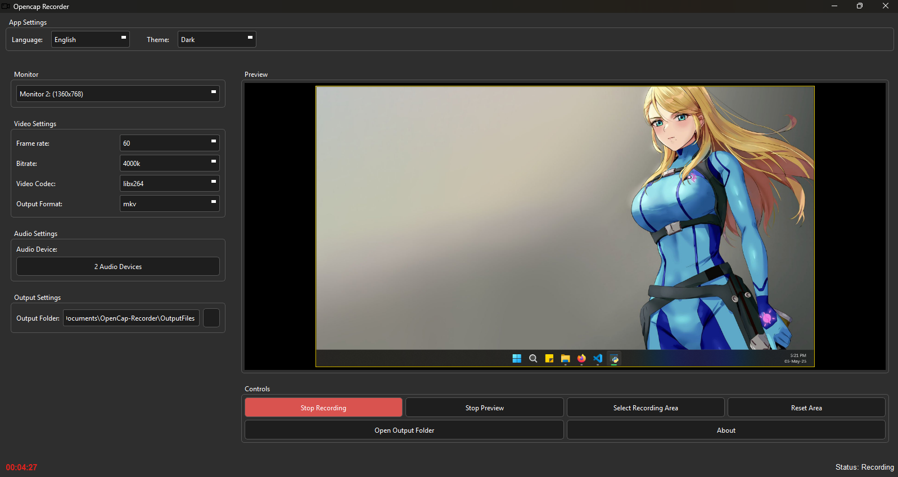

# OpenCap Recorder

An open-source screen and audio recorder for **Windows** and **Linux**, written in Python.

<p align="center">
  
</p>

---

## 🎯 Features

- Multiple themes
- Set frame rate and bitrate
- Choose video codec
- Select output format (mp4, mkv)
- Select audio input or output device
- Select screen area or full screen to record
- Multi-monitor support
- Multi-language support

---

## ⚙️ How to Run

The main file to run the app on **any platform** is:

```bash
python app.py
```

---

### 💻 Requirements

You need Python 3.x and FFmpeg installed. The Windows version already comes with FFmpeg included.
For Linux, FFmpeg must be installed manually.

All required Python packages are listed in the requirements.txt file.

---

### 💻 Windows

1. Install Python

2. (Recommended) Create and activate a virtual environment

```bash
python -m venv venv
venv\Scripts\activate
```

3. Install the dependencies:

```bash
pip install -r requirements.txt
```

---

### 🐧 Linux (Debian-based: Ubuntu, Mint, etc.)

1. Install FFmpeg and Qt6 dependencies:

Most systems already come with Python preinstalled, but you must install FFmpeg and required Qt6 libraries:

```bash
sudo apt update
sudo apt install ffmpeg libxcb-cursor0 libxcb-cursor-dev
```

**Note:** The `libxcb-cursor` packages are required for Qt6 applications to run properly on Linux.

2. (Recommended) Create and activate a virtual environment

```bash
python3 -m venv venv
source venv/bin/activate
```

3. Install required Python packages

```bash
pip install -r requirements.txt
```

---

## ⚠️ Known Issues

### UAC Prompt (Windows)

To avoid screen dimming while recording, go to *User Account Control Settings* and select:

> **"Notify me only when apps try to make changes to my computer (do not dim my desktop)"**

Or disable UAC entirely (not recommended for most users).

### Choppy Recording

If the recording is not smooth, try the recommended settings for best results:

- **Codec:** `libx264`
- **Format:** `mp4`
- **Bitrate:** `2000k`

### System Audio Not Captured

To record system audio on Windows, enable **Stereo Mix** in your Sound settings  
(*Recording* tab → Right-click → Show Disabled Devices → Enable Stereo Mix).

Be sure to check the volume, Stereo Mix alters in real time the volume of your computer while recording.

---

## 📄 License

This project is licensed under the MIT License.